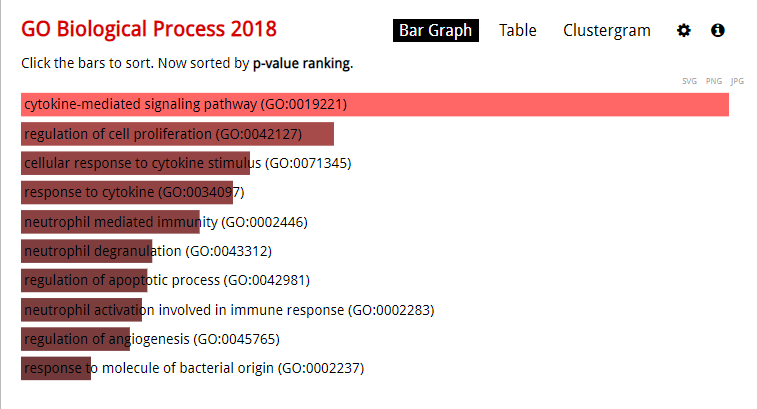
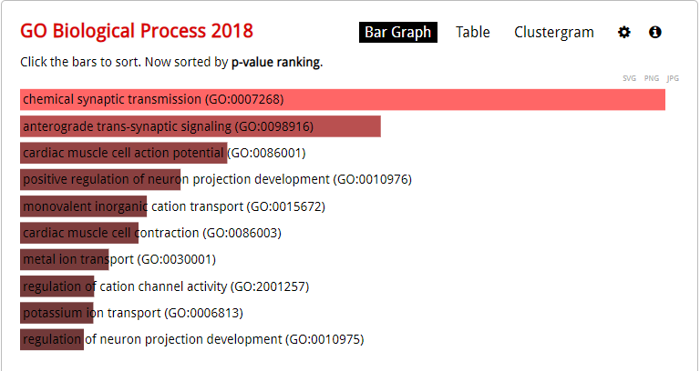

```{r setup, include=FALSE}
knitr::opts_chunk$set(echo = TRUE)
```
# Assignment 3

## 1. What is the general idea behind variance adjustment methods when testing for differential expression? Explain the method and why it is acceptable to use adjustment.
The general idea is that with variance adjustment one attempts to estimate variance according to sample size. We usually transform data to stabilize response variables, making the response variable close to a normal distribution and fitting the model assumptions (which in Limma is a linear model) (Montgomery, 2017, p.656). A method that assumes independently sampled reads is the Poisson-model. Poisson assumes that the variance and the mean are alike, but does not account for dependability which usually arises in biological samples. Assuming that variance in genes are independent of eachother may be wrong (e.g the omnigenics model), and  throws away a lot of potential answers. If we have a small sample size it is difficult to precisely estimate the true variance for a certain gene and so it is sometimes necessary to estimate variance using similarily expressed genes or pseudodata. Negative binomial distribution assumes that genes have different mean and variance. Whether or not they are differentially expressed then depends on the significance level set by the analyzer. Usually when analyzing genes we have few replicates and would therefore require either more data or follow empirical bayes which borrows information across genes. This adjustment (Bayes) is acceptable because although some genes have higher variation than others, the variation in general should be the same for all genes (Hvidsten, 2020). Therefore we compute the average variance of all genes and adjust the variance of each gene to look more like the mean variance using a weight. We can thereafter test if there is a difference in variance using an adjusted t-test. 

Sources: 
Montgomery, D 2017, *Design and analysis of experiments*, 9th edition. Wiley, Hoboken, NJ
Hvidsten, T.R, "BIN315 week 3 part 1", 2020, https://www.youtube.com/watch?v=RTDMHvmoDL4&feature=youtu.be   

## 2. Describe the main differences between finding differentially expressed genes from microarray data and RNA-Seq data.
RNA-Seq data uses counts unlike microarray data which uses intensity-concentration. Microarray data is probe based and the different concentrations are independent of each other, whereas RNA-Seq assumes a general mean for all genes. With RNA seq we try to estimate if there is a significant difference in read count. Microarray data on the other hand is inherently continuous while RNA-seq data is count-based. The counts in RNA seq is limited by the sequencing depth and is therefore dependent on comparison of other transcrips. Because of this a number of statistical tests has been implemented in order to find DEGs in RNA-Seq and they all vary in specificity and sensitivity (Rapaport et. al, 2013). Microarray data however is measured using match probes followed by a quantile normalization (a technique that makes two distribution identical statistically). However, with microarray you often run a statistical test many times to check for differences between samples which increases the odds of making a type-1-error (getting a false positive), so usually the p values are often adjusted to take the multiple testing into consideration. In RNA-seq a design matrix is necessary to compare samples this is to better label the tests. Like microarray DEGs are analyzed after normalization and p-tests, but as mentioned RNA-Seq is count based. You further also have to account for the FDR (false discovery rate, probability of doing a type I error). Genes are in RNA-seq meaningful if they pass a certain threshold in the log fold change. 

Sources: 
Hvidsten, T.R,*BIN315 week 3 part B*, 2020, https://www.youtube.com/watch?v=iaIHti7Tg3M&feature=youtu.be  
Rapaport, F, Khanin, R, Liang, Y, Pirun, M, Krek, A, Zumbo, P, Mason, C, Socci, N, Betel, D. *Comprehensive evaluation of differential gene expression analysis methods for RNA-seq data*, 2013, Genome biology, 14:R95, http://genomebiology.com/2013/14/9/R95 

## 3. What is (1) function enrichment analysis and (2) gene set enrichment analysis? Explain each method first and then discuss similarities and differences.
Function enrichment analysis is the test to see if the differentially expressed genes are enriched in the functional categories that may have an association with a given phenotype. You typically check if the gene you have found (given a p value threshold) can be connected physiologically to a given phenotype using known gene functions (for instance in blood coagulation). In gene set enrichment analysis you check if a set of genes tend to be at the top of a ranked list of differential expressed genes. In GSEA you calculate an enrichment score that represents which genes are over represented at the top or bottom of the list. You then estimate the statistical significance of the enrichment score. Afterwards you adjust for multiple hyptohesis testing and FDR. In FEA you only account for the DEGs below a significance value whereas in GSEA you only sort by DEG and check if the group of genes are represented at the top or bottom of the list. So for GSEA you only test if the difference between two cell categories are at the top or bottom of the list. Whereas for FEA you take the p value of DEGs into account.  

Hvidsten, T.R,*BIN315 week 3 part B*, 2020, https://www.youtube.com/watch?v=iaIHti7Tg3M&feature=youtu.be  
## Computer lab
```{r}
library(beadarray)
load("voineagu_normalized_microarray.Rdata")

# Checks for same number as Voineagu for cortex
table(pData(bsd.cortex.norm)$condition)

#checks for cerebellum
table(pData(bsd.cerebellum.norm)$condition)
```

Gives same number as Voineagu described in the article. 

```{r}
library(limma)
#making a design matrix for the cortex samples
cortex.design <- cbind( intercept=1,
                        autism=ifelse(pData(bsd.cortex.norm)$condition == "autism", 1, 0) )

cortex.fit <- lmFit(exprs(bsd.cortex.norm), cortex.design)
cortex.fit <- eBayes(cortex.fit)
topTable(cortex.fit, coef=2, p.value = 0.05, lfc = log2(1.3))
```
*How many probes have been tested?*

```{r}
nrow(topTable(cortex.fit, coef = 2, number = Inf))
```

12 353 probes have been tested

*How many of the probes have an adjusted p-value < 0.05?*
```{r}
nrow(topTable(cortex.fit, coef = 2, number = Inf, p.value = 0.05))
```

2083 probes have an adjusted p-value less than 0.05

*How many of the significant probes do you expect to be false positives?*
2083 * 0.05 = 104 false positives.


In the article they only count probes that have a minimum fold change of 1.3. This extra criteria is commonly added to make sure that the differences in expression are biological relevance. How many probes has an adjusted p-value < 0.05 and a fold change > 1.3? OBS: The topTable-function wants log2-fold-change!
```{r}
nrow(topTable( cortex.fit, coef=2, lfc=log2(1.3), number = Inf, p.value=0.05))
```
In the report they identified 444 genes with significant expression changes in autism cortex samples, here we only identified 415.

# RNA-Seq data
Cortex vs control

```{r}
library(BiocManager)
load("voineagu_normalized_rnaseq.RData")
# load DESeq2
library(DESeq2)


# DESeq results for normalized data (dds)
dds <- DESeq(dds)
res <- results(dds)


```

*Some genes (e.g. ENSG00000000005) does not get an adjusted p-value (NA). This is because DESeq has decided that it cannot reliably compute significance for this gene due to low expression or outlier. Question: Why do you think some genes only have NA-values?*

Because the difference in gene may be close to 0 or equal to each other
```{r}
# Want to know how many DEG + sorted table
# With a FDR cutoff of 0.05
res0.05 <- subset(res, padj < 0.05)
res0.05[order(res0.05$padj),]
```

*How many genes with expression were tested?*
```{r}
nrow(dds)
```

*What proportion of genes are DEGs?*

```{r}
nrow(res0.05)/nrow(dds)
```
8,6% of genes are DEGs

*How many DEGs are up and how many are down in autism? Are there more genes increasing or decreasing in expression?*

```{r}
sum(res0.05$log2FoldChange <= 0)

sum(res0.05$log2FoldChange >= 0)
```
860 DEGs downregulated vs 1000 upregulated. There are more genes increasing in expression

*How many DEGs do we expect to be false positives given the FDR cutoff?*

```{r}
nrow(res0.05) * 0.05
```
Expect 93 false positives. 


# MA plot for visual overview of the DE results

```{r}
plotMA(res, alpha = 0.05)
```

*Why aren’t all genes with a log fold change above a certain level DEGs (i.e. why are there grey dots among the blue dots)?*
Because we haven't accounted for FDR yet. Meaning some values have a high p value and is still located above a certain level of significance.

*Why are there so many genes with high log fold change that are not DEGs on the left hand side of the plot?*
There are genes with a lower count number with such a high variety (and p value) that they are not deemed significant.

*Create a new table from res that contains significant DEGs (FDR < 0.05) with expression levels that are either double that of the control condition or half that of the control condition.*
```{r}

# Filtrerer først vekk NA

# Lager deretter tabellen, deler opp i 2 da jeg slet med intervall
res_new <- na.omit(res)
res_1 <-  subset(res_new, res_new$log2FoldChange >= 1 & padj < 0.05)
res_2 <- subset(res_new, res_new$log2FoldChange <= -1 & padj < 0.05)

# Skjøter sammen tabellene
res_n <- rbind(res_1, res_2)

```

*Sort and print the table. How many genes are in the table?*
There are a total of 1705 genes in the table

```{r}
id_table <- read.table("Human_ensembl_ids_to_symbols.txt", header = TRUE, sep = "\t", stringsAsFactors = FALSE)

# Example vector of gene names
gene.names <- c("ENSG00000143842", "ENSG00000144810", "ENSG00000146966")

# Merge gene names 
gene.symbols <- merge(data.frame(ensembl_id = gene.names), id_table)$gene_symbol

write(gene.symbols, file="genes.txt", sep = "\n")

```

*Convert and write the gene symbols from the DEG table (filtering on both FDR and fold change) to separate files for up- and down-regulated genes.*

```{r}
up_regulated <- attributes(res_1)$rowname
up_regulated_symbol <- merge(data.frame(ensembl_id = up_regulated), id_table)$gene_symbol
write(up_regulated_symbol, file="upregulatedgenes.txt", sep="\n")

down_regulated <- attributes(res_2)$rowname
down_regulated_symbol <- merge(data.frame(ensembl_id = down_regulated), id_table)$gene_symbol
write(down_regulated_symbol, file="downregulatedgenes.txt", sep="\n")
```


*Open the enrichr web site, click the “Choose file” button to upload the file you created with the up-regulated gene symbols and click “Submit”. The enrichr tool has several categories to choose from, you should select the “ontologies”-tab and then “GO Biological Processs”. There you should see a list of enriched gene ontology terms. Do you see anything related to immune and inflammatory response like they found in the paper?*


*Repeat the analysis with the down-regulated genes. Do the results differ? Do they make sense biologically?*



Based on the picture an upregulation of the cytokine-mediated signalling pathway makes sense biologically as people with autism are known to be quite sensitive to stimulus. 


Based on the picture the downregulation of some chemical synaptic transmission seems plausible seeing as (some)autistic people lack  social skills which may be located in the brain. 

source:
Chen EY, Tan CM, Kou Y, Duan Q, Wang Z, Meirelles GV, Clark NR, Ma'ayan A. Enrichr: interactive and collaborative HTML5 gene list enrichment analysis tool. BMC Bioinformatics. 2013;128(14).

Kuleshov MV, Jones MR, Rouillard AD, Fernandez NF, Duan Q, Wang Z, Koplev S, Jenkins SL, Jagodnik KM, Lachmann A, McDermott MG, Monteiro CD, Gundersen GW, Ma'ayan A. Enrichr: a comprehensive gene set enrichment analysis web server 2016 update. Nucleic Acids Research. 2016; gkw377 .
